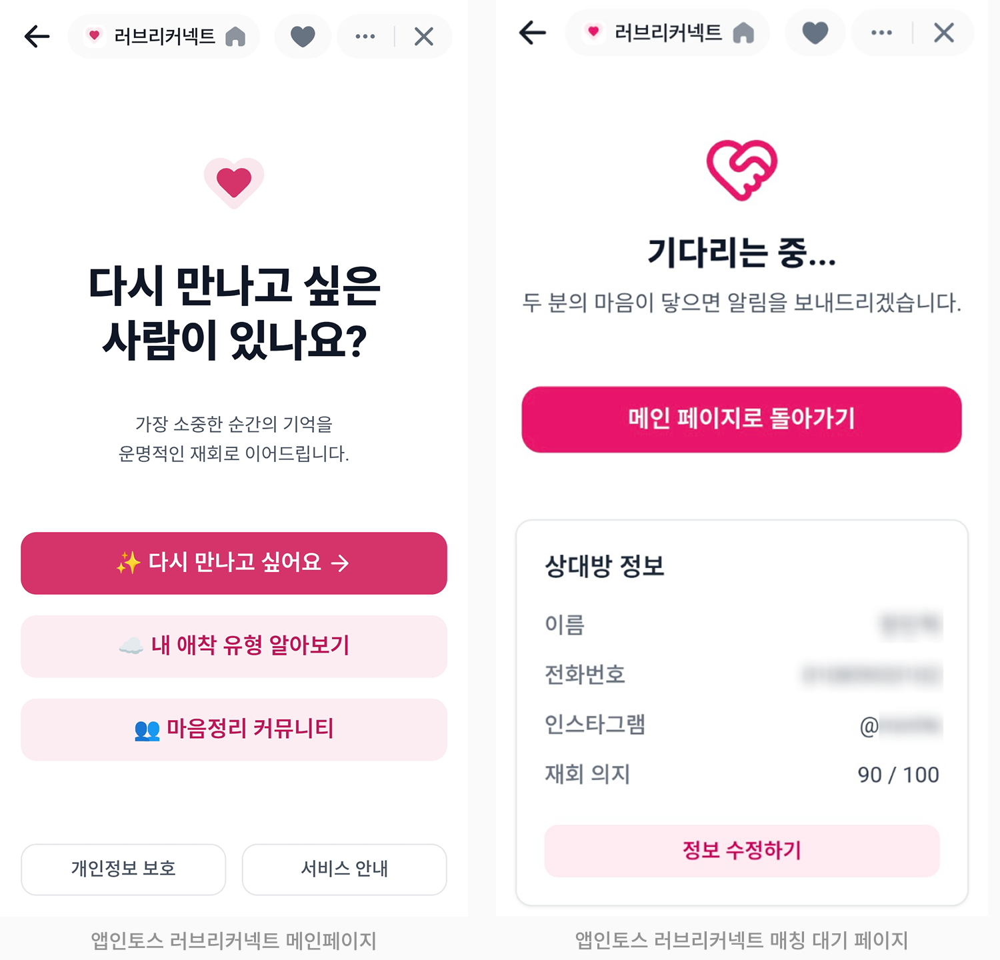
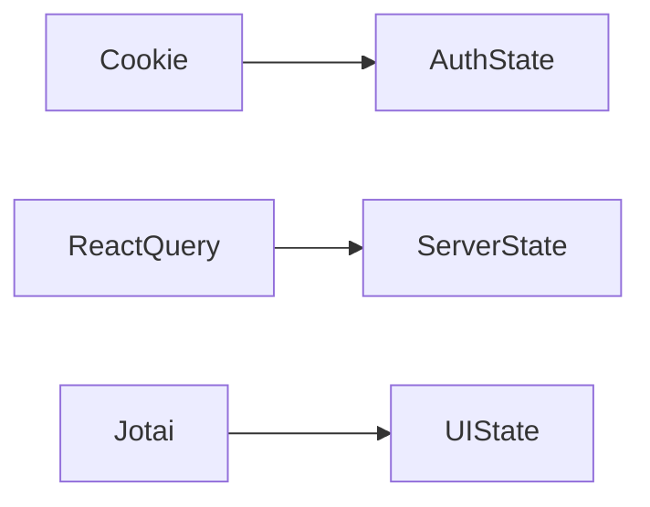
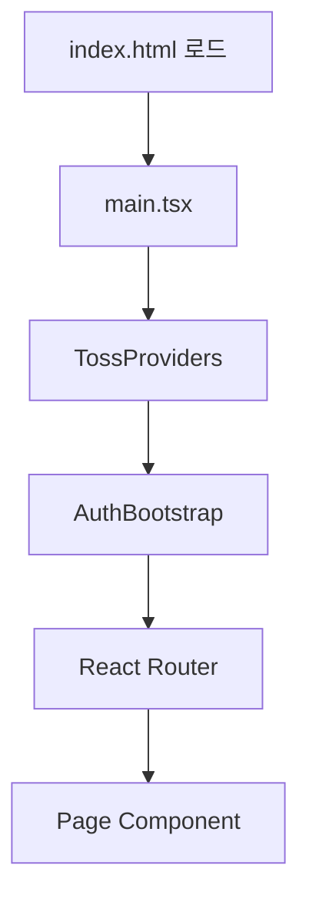
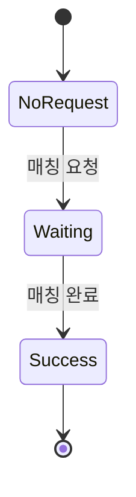

# lovereconnect-toss-app

> Toss Mini App 전용 재회 매칭 서비스 클라이언트  
> 단일 탭 WebView 환경에 최적화된 순수 CSR 기반 SPA
## ✨ Main Screen

<p align="center">
  
</p>

---

## 📱 Why a Separate Client?

웹 버전(Next.js SSR)과 달리 Toss Mini App은 다음과 같은 특성이 있습니다:

- `appLogin()` SDK 기반 인증 (브라우저 전용)
- SSR 불가능 (클라이언트 환경에서만 동작)
- 단일 탭 WebView 환경
- 앱 네이티브 UI(TDS) 사용

이 프로젝트는 이러한 제약을 전제로 **CSR 중심 아키텍처로 재설계된 클라이언트**입니다.

---

# 🏗 Architecture Overview

## 🔐 Authentication Flow

```mermaid
flowchart TD
    A[Toss Mini App 실행] --> B[appLogin()]
    B --> C[authorizationCode 획득]
    C --> D[Backend Toss Login API]
    D --> E[HTTPOnly Cookie 설정]
    E --> F[Jotai authAtom 업데이트]
```

### 특징

- Toss 플랫폼 인증 위임
- 서버 검증 후 HTTPOnly 쿠키 설정
- `isNewMember` 여부에 따라 추가 정보 입력 페이지 분기
- 단일 탭 환경 (다중 탭 race condition 없음)

---

## 🧠 State Management

### 역할 분리 구조



| 계층            | 역할                          |
| --------------- | ----------------------------- |
| HTTPOnly Cookie | 토큰 영속성                   |
| React Query     | 서버 데이터 (매칭, 게시글 등) |
| Jotai           | 로그인 상태, UI 즉시 반응     |

### 설계 원칙

- 서버 상태는 React Query가 단일 진실
- 전역 상태 최소화 (authAtom만 유지)
- 모든 페이지에서 SSR 없이 `auth/me` 기반 세션 복원

---

## ⚙ Rendering Strategy — Pure CSR



### CSR 선택 이유

- Toss SDK는 브라우저에서만 동작
- SSR 환경에서 인증 불가능
- Mini App에서는 SEO 필요 없음
- 상호작용 성능이 더 중요

---

## 🔄 Matching Flow Control



- 서버 응답 기반 자동 라우팅
- 뒤로가기/새로고침 시 서버 재검증
- 클라이언트 추정 상태 제거

---

## 💬 Pagination Strategy (Community)

- 무한스크롤 ❌
- **이전 페이지 불러오기 방식 채택**
- 서버 정렬 기준 신뢰
- 명시적 캐시 무효화 (`invalidateQueries`)

---

## 🧩 Tech Stack

- React 18
- Vite
- React Router
- TanStack Query v5
- Jotai
- React Hook Form
- Zod
- Toss TDS (@toss/tds-mobile)

---

## 📂 Project Structure

```
src/
├── main.tsx
├── App.tsx
├── pages/
│   ├── auth/
│   ├── match/
│   ├── community/
│   └── attachment/
│
├── atoms/
│   └── authAtom.ts
│
├── hooks/
│   ├── useAuth.ts
│   ├── useMatch.ts
│   ├── usePosts.ts
│   └── useAttachment.ts
│
├── providers/
│   ├── TossProviders.tsx
│   └── AuthBootstrap.tsx
│
├── lib/api/
│   └── client.ts
```

---

## 🎯 Design Principles

- 플랫폼 제약을 먼저 이해하고 설계
- 서버를 진실의 원천으로 사용
- 최소한의 전역 상태 유지
- CSR 환경에서 인증 일관성 보장
- 명시적 캐시 전략으로 데이터 동기화 제어

---

> 이 프로젝트는 **Mini App 환경에 맞춘 아키텍처 재설계 경험**을 중심으로 발전했습니다.
